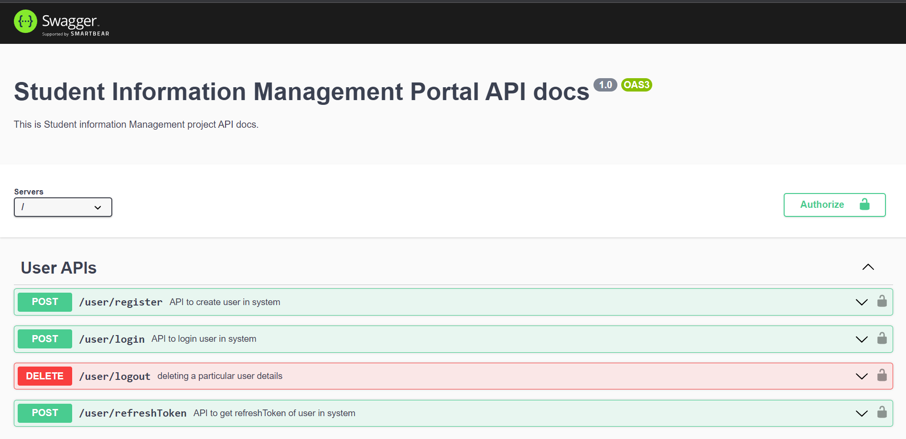
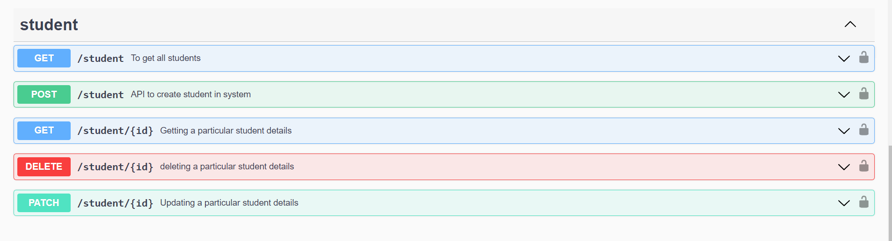
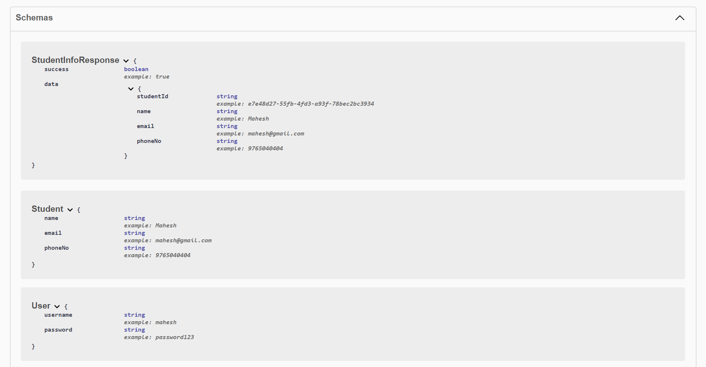
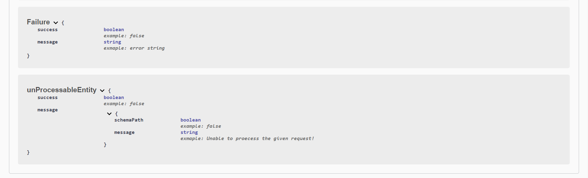

# Student Information  Management Backend Application

This is a backend application built using TypeScript, Node.js, Express.js, and MongoDB, designed to provide a REST API interface for managing student Information . The application supports CRUD (Create, Read, Update, Delete) operations on student records. Each API route is secured with JWT (JSON Web Token) authentication, ensuring the security and privacy of the data.


## Table of Contents
1. [Features](#features)
2. [Technologies Used](#technologies)
3. [Architecture](#architecture)
4. [Project Structure](#project-structure)
5. [Installation](#installation)
6. [Scripts Available](#scripts-available)
7. [API Documentation](#api-documentation)
8. [Conclusion](#conclusion)

---
## Features
- Secure authentication with JWT.
- REST API endpoints for student CRUD operations.
- Unit test cases for robustness and reliability.
- Swagger UI documentation for easy API exploration.
- ESLint integration for code quality and consistency.

---
## Technologies 
| Technology     | Version | 
| :-------------:|:-------:|
| **TypeScript** | 5.0.4   |
| **Node.js**    | 18.16.0 |
| **Express.js** | 4.18.2  |
| **Swagger UI** | 3.0.1   |
|  **Jest**      |29.5.0   |

---
## Architecture
The application follows a layered architecture, separating concerns and promoting code modularity. 

## Model
The `models/` directory contains the data models and schemas used for student records. These models define the structure and validation rules for the data stored in the MongoDB database.

## Controller
The `controllers/` directory houses the controller modules responsible for handling HTTP requests and responses. Each controller contains methods that handle specific API endpoints and interact with the services to perform the requested operations.

## Services
The `services/` directory contains the service modules that implement the business logic for the application. These services interact with the database models to perform CRUD operations on student records.


The key layers are as follows:
- **Presentation Layer**: Handles incoming HTTP requests and routes them to the appropriate controller methods.
- **Controller Layer**: Handles request validation, authentication, and delegates the business logic to the service layer.
- **Service Layer**: Implements the business logic, interacts with the data models, and performs CRUD operations.
- **Data Access Layer**: Contains the MongoDB data models and handles the database interactions.
- **Utilities**: Includes helper functions and utilities used across the application.

---
## Project Structure
The project follows a structured organization to ensure maintainability and scalability. The key directories and files are as follows:

```
├── config/
│   ├── development.ts
│   ├── development.ts
│   └── test.ts
├── src/
│   ├── __test__/
│   ├── controllers/
│   ├── middlewares/
│   ├── models/
│   ├── routes/
│   ├── services/
│   ├── utils/
│   └── app.ts
├── .env
├── .eslintrc.json
├── .gitignore
├── api.yaml
├── jest.config.js
├── package.json
├── README.md
└── tsconfig.json
```
### Below describes detailed file structure
- [**config**](./config/)
    - It includes the files of configuration for different environments such as testing, development and production.

- [**src**](./src/) : Contains the main source code for the application.
    - [**__test__**](./src/__test__/)
        - Includes the unit tests for various components of the application. written using [Jest](https://jestjs.io/).
    - [**controllers**](./src/controllers/)
        - Defines the controller modules responsible for handling HTTP requests and responses.

    - [**middlewares**](./src/middleware/)
        - It includes the middleware functions responsible for token authentication.
    - [**models**](./src/models/)
        - Contains the data models and schemas for student records.
    
    - [**routes**](./src/routes/)
        - Defines the API routes and maps them to the appropriate controller methods.

    - [**services**](./src/services/)
        - Implements the business logic and interacts with the database using [Mongoose](https://mongoosejs.com/) as ORM.
    
    - [**utils**](./src/utils/)
        - Contains utility functions and helpers.

  - [**app.ts**](./src/app.ts): Entry point for the application, initializes and configures the Express.js server.
  
- `.eslintrc.json`: Configuration file for ESLint, ensuring code quality and adherence to standards.
- `.gitignore`: Specifies which files and directories should be ignored by version control.
- `api.yaml` : Contains the API documentation written with [openAPI 3.0](https://swagger.io/specification/)
- `jest.config.js` : Contains the configuration for the Jest for testing.
- `package.json`: Contains the project dependencies and scripts.
- `README.md`: Documentation file for the project.
- `tsconfig.json`: Contains the TypeScript compiler configurations.


---

## Installation

To run the Employee Management System APIs locally, follow these steps:

1. Clone the repository:
```bash
git clone https://github.com/Maheshmali1/student_info_management
```
2. Navigate to the project directory: 
```bash
cd student_info_management
```
3. Install the dependencies: 
```bash
npm install
```
4. Start the application: 
```bash
npm run start
```
5. Enter address to see API docs
```bash
http://localhost:3000/api-docs
```
---
## Scripts Available

```bash
npm run build
```
Runs : `tsc`\
This runs the tsc (TypeScript compiler) and compile the files mentioned in the configurations to dist folder.

---

```bash
npm run start
```
Runs : `npm run build && cross-env NODE_ENV=production node dist/app.js`\
This runs the application in the `production` environment using `node`.

---

```bash
npm run dev
```
Runs : `npm run build && cross-env NODE_ENV=development nodemon dist/app.js`\
This runs the application in the `development` environment using `nodemon`.

---

```bash
npm run test
```
Runs : `cross-env NODE_ENV=test jest`\
This will execute the test cases written using `Jest` and provide feedback on the code's functionality and correctness.

---

```bash
npm run linterCheck
```

Runs : `npm run build && cross-env NODE_ENV=production eslint src`\
This will run the ES-Linter and list out the linting errors to console.

---


```bash
npm run linterFix
```
Runs: `npm run build && cross-env NODE_ENV=production eslint src --fix`\
This will run the ES-Linter to find the errors and fix the possible errors with default configurations.

---

## API Documentation

The Student Information management APIs come with interactive API documentation generated by Swagger UI. To explore the APIs and interact with them, click on the link below:

API Docs Link : [API Documentation](https://swagger.io/)

---
Click on the API Documentation link to see the live APIs and start using them.

### API Docs Images using Swagger UI







Thank you for choosing the EStudent Information Management APIs! If you have any questions or need further assistance, please don't hesitate to reach out.

---


## Author

The Drone Management System is developed and maintained by [Mahesh Mali](https://github.com/Maheshmali1).

---

## Acknowledgements

We would like to express our gratitude to the open-source community for providing the tools and frameworks that made this project possible. We also extend our thanks to the contributors and users who have helped improve the system through feedback and suggestions.

---
## Conclusion

With this Student Information Management backend application, you can easily perform CRUD operations on student records through the secure REST API interface. The project provides JWT authentication, unit test coverage, Swagger UI documentation, and follows a structured architecture to ensure a robust and scalable solution.

---
Thank you for using the **Student Information  Management**!

---