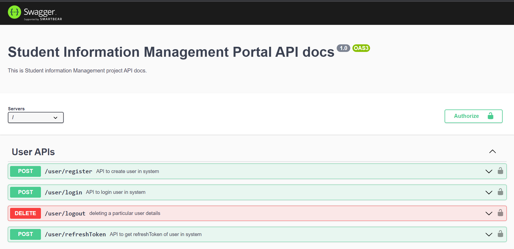
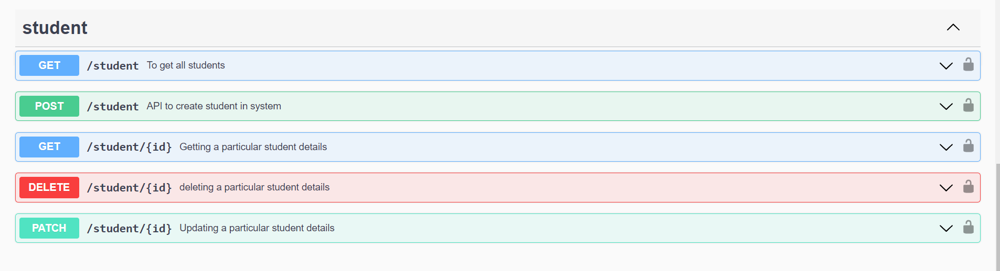
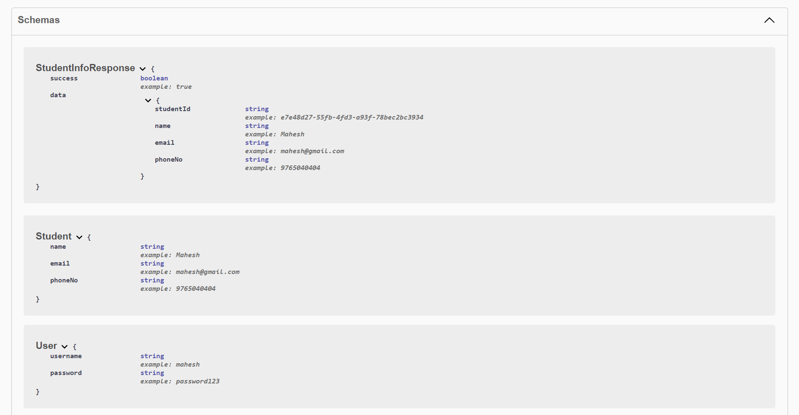
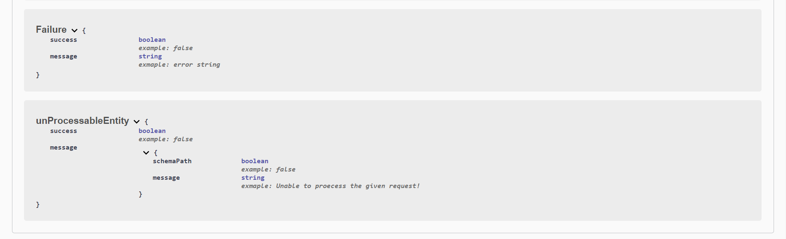

Student Details Management Web Application
=========================================

The Student Details Management Web Application is a comprehensive system designed to efficiently manage and organize student information. It provides a user-friendly interface with features such as login, registration, and a dashboard for managing all student data.

Frontend Technologies:
----------------------
The frontend of the application is built using HTML, CSS, JavaScript, jQuery, and Bootstrap. These technologies create an intuitive and visually appealing user interface. Bootstrap enhances the design and layout, ensuring a responsive and consistent experience across different devices. The login and registration functionality provides secure access, while the dashboard serves as a centralized hub for managing student information.

Backend Technologies:
---------------------
The backend of the application is developed using TypeScript, Node.js, Express.js, and MongoDB. TypeScript brings the benefits of static typing and enhanced tooling to the Node.js ecosystem. Node.js serves as the runtime environment for executing JavaScript code on the server-side. Express.js is a fast and minimalist web application framework that simplifies the development of robust APIs. MongoDB, a popular NoSQL database, is utilized to store and manage student records efficiently.

REST API and CRUD Operations:
-----------------------------
The application exposes a REST API interface, allowing client applications to interact with the backend. The API supports CRUD (Create, Read, Update, Delete) operations on student records. This means that users can create new student entries, retrieve existing data, update information, and delete records as needed. The API endpoints are designed to be intuitive and easy to use, providing a seamless experience for managing student details.

JSON Web Token Authentication:
------------------------------
To ensure the security and privacy of data, the application incorporates JSON Web Token (JWT) authentication. This authentication mechanism requires users to provide a valid token with each API request. The token is generated upon successful login or registration and is used to authenticate and authorize requests. This adds an extra layer of security, preventing unauthorized access to sensitive student information.

Overall, the Student Details Management Web Application offers a robust and secure solution for efficiently managing student data. With its user-friendly frontend, powerful backend technologies, RESTful API, and JWT authentication, it provides a seamless experience for administrators and users alike.


## Table of Contents
1. [Features](#features)
2. [Technologies Used](#technologies)
3. [Architecture](#architecture)
4. [Project Structure](#project-structure)
5. [Installation](#installation)
6. [Scripts Available](#scripts-available)
7. [API Documentation](#api-documentation)
8. [Conclusion](#conclusion)

---
## Features
Frontend Features:
------------------

- Responsive Design
- Local Storage
- Form Validation
- Interactive User Interface
- Data Search and Filtering
- Data Visualization
- Error Handling and Feedback
- Integration with Backend APIs

Backend Features
---------------

- Secure authentication with JWT.
- REST API endpoints for student CRUD operations.
- Unit test cases for robustness and reliability.
- Swagger UI documentation for easy API exploration.
- ESLint integration for code quality and consistency.

---
## Technologies 
| Technology     | Version | 
| :-------------:|:-------:|
| **JQuery**     | 1.11.1  |
| **BootStrap**  | 4.1.1   |
| **TypeScript** | 5.0.4   |
| **Node.js**    | 18.16.0 |
| **Express.js** | 4.18.2  |
| **Swagger UI** | 3.0.1   |
|  **Jest**      |29.5.0   |

---
## Architecture

Frontend Architecture:
----------------------

The frontend architecture of the Student Details Management Web Application follows a modular approach, organized into separate folders for assets, styles, and JavaScript files, along with an index.html file in the root directory.

### Assets
   The assets folder contains various resources used in the application, such as images, fonts, icons, and other media files. These assets are essential for creating an engaging and visually appealing user interface. Placing them in a dedicated folder ensures easy management and accessibility throughout the application.

### Styles
   The styles folder stores all the CSS files related to the application's styling. This includes custom CSS files and potentially any third-party CSS frameworks or libraries. Separating the styles into a distinct folder promotes modularity and allows for easier maintenance and customization. The styles defined here control the visual appearance and layout of the application.

### JS
   The JS folder houses all the JavaScript files that power the frontend functionality of the application. This includes the custom JavaScript code written specifically for the application's features and interactions. The modular structure allows for the separation of concerns, making the codebase more organized and maintainable. It also enables easy integration of external libraries or frameworks as needed.

### Index.html
   The index.html file is the entry point of the application. It serves as the main HTML file that is loaded by the web browser. It typically contains the basic HTML structure, links to the necessary CSS and JavaScript files, and acts as a container for rendering the application's user interface. The index.html file coordinates the loading of styles, scripts, and assets, providing a starting point for the application's frontend functionality.


Backend Architecture 
-------------------
The application follows a layered architecture, separating concerns and promoting code modularity. 

## Model
The `models/` directory contains the data models and schemas used for student records. These models define the structure and validation rules for the data stored in the MongoDB database.

## Controller
The `controllers/` directory houses the controller modules responsible for handling HTTP requests and responses. Each controller contains methods that handle specific API endpoints and interact with the services to perform the requested operations.

## Services
The `services/` directory contains the service modules that implement the business logic for the application. These services interact with the database models to perform CRUD operations on student records.


The key layers are as follows:
- **Presentation Layer**: Handles incoming HTTP requests and routes them to the appropriate controller methods.
- **Controller Layer**: Handles request validation, authentication, and delegates the business logic to the service layer.
- **Service Layer**: Implements the business logic, interacts with the data models, and performs CRUD operations.
- **Data Access Layer**: Contains the MongoDB data models and handles the database interactions.
- **Utilities**: Includes helper functions and utilities used across the application.

---
## Project Structure
The project follows a structured organization to ensure maintainability and scalability. The key directories and files are as follows:

```
├── backend/
|   ├── config/
|   │   ├── development.ts
|   │   ├── production.ts
|   │   └── test.ts
|   ├── src/
|   │   ├── __tests__/
|   │   ├── controllers/
|   │   ├── middlewares/
|   │   ├── models/
|   │   ├── routes/
|   │   ├── services/
|   │   ├── utils/
|   │   └── app.ts
|   ├── .env
|   ├── .eslintrc.json
|   ├── .gitignore
|   ├── api.yaml
|   ├── jest.config.js
|   ├── package.json
|   ├── README.md
|   └── tsconfig.json
├── frontend/
|   ├── assets/
|   ├── js/
|   └── styles/
└── README.md
```
### Below describes detailed file structure

Backend File structure 
-------
- [**config**](./backend/config/)
    - It includes the files of configuration for different environments such as testing, development and production.

- [**src**](./backend/src/) : Contains the main source code for the application.
    - [**__test__**](./backend/src/__test__/)
        - Includes the unit tests for various components of the application. written using [Jest](https://jestjs.io/).
    - [**controllers**](./backend/src/controllers/)
        - Defines the controller modules responsible for handling HTTP requests and responses.

    - [**middlewares**](./backend/src/middleware/)
        - It includes the middleware functions responsible for token authentication.
    - [**models**](./backend/src/models/)
        - Contains the data models and schemas for student records.
    
    - [**routes**](./backend/src/routes/)
        - Defines the API routes and maps them to the appropriate controller methods.

    - [**services**](./backend/src/services/)
        - Implements the business logic and interacts with the database using [Mongoose](https://mongoosejs.com/) as ORM.
    
    - [**utils**](./backend/src/utils/)
        - Contains utility functions and helpers.

  - [**app.ts**](./backend/src/app.ts): Entry point for the application, initializes and configures the Express.js server.
  
- `.eslintrc.json`: Configuration file for ESLint, ensuring code quality and adherence to standards.
- `.gitignore`: Specifies which files and directories should be ignored by version control.
- `api.yaml` : Contains the API documentation written with [openAPI 3.0](https://swagger.io/specification/)
- `jest.config.js` : Contains the configuration for the Jest for testing.
- `package.json`: Contains the project dependencies and scripts.
- `README.md`: Documentation file for the project.
- `tsconfig.json`: Contains the TypeScript compiler configurations.

Frontend File structure
-----
- [**assets**](./frontend/assets/): This folder contains various resources used in the frontend, such as images, fonts, icons, and other media files. These assets are essential for creating an engaging and visually appealing user interface.

- [**js**](./frontend/js/): The JS folder holds JavaScript files responsible for the frontend functionality of the application. These files contain the logic and behavior that enable dynamic interactions and data manipulation in the user interface.

- [**styles**](./frontend/styles/): The styles folder stores CSS files used for styling the frontend user interface. These files define the visual appearance, layout, and design elements of the application, ensuring a visually consistent and appealing presentation

## Installation

To run the Employee Management System APIs locally, follow these steps:

1. Clone the repository:
```bash
git clone https://github.com/Maheshmali1/student_info_management
```
2. Navigate to the project directory: 
```bash
cd student_info_management/backend
```
3. Install the dependencies: 
```bash
npm install
```
4. Start the backend server: 
```bash
npm run start
```
5. Enter address in browser to see web app
```bash
YOUR_SYSTEM_PATH/student_details_management/frontend/index.html
```

5. Enter address to see API docs
```bash
http://localhost:3000/api-docs
```
---
## Scripts Available in Backend 

```bash
npm run build
```
Runs : `tsc`\
This runs the tsc (TypeScript compiler) and compile the files mentioned in the configurations to dist folder.

---

```bash
npm run start
```
Runs : `npm run build && cross-env NODE_ENV=production node dist/app.js`\
This runs the application in the `production` environment using `node`.

---

```bash
npm run dev
```
Runs : `npm run build && cross-env NODE_ENV=development nodemon dist/app.js`\
This runs the application in the `development` environment using `nodemon`.

---

```bash
npm run test
```
Runs : `cross-env NODE_ENV=test jest`\
This will execute the test cases written using `Jest` and provide feedback on the code's functionality and correctness.

---

```bash
npm run linterCheck
```

Runs : `npm run build && cross-env NODE_ENV=production eslint src`\
This will run the ES-Linter and list out the linting errors to console.

---


```bash
npm run linterFix
```
Runs: `npm run build && cross-env NODE_ENV=production eslint src --fix`\
This will run the ES-Linter to find the errors and fix the possible errors with default configurations.

---

## API Documentation

The Student Information management APIs come with interactive API documentation generated by Swagger UI. To explore the APIs and interact with them, click on the link below:

API Docs Link : [API Documentation](https://swagger.io/)

---
Click on the API Documentation link to see the live APIs and start using them.

### API Docs Images using Swagger UI







Thank you for choosing the Student Information Management APIs! If you have any questions or need further assistance, please don't hesitate to reach out.

---


## Author

The Student Details Management Web Application is developed and maintained by [Mahesh Mali](https://github.com/Maheshmali1) and Onkar Viralekar

---

## Acknowledgements

We would like to express our gratitude to the open-source community for providing the tools and frameworks that made this project possible. We also extend our thanks to the contributors and users who have helped improve the system through feedback and suggestions.

---
## Conclusion

Student Details Management Web Application offers a comprehensive frontend and backend solution for efficiently managing student information. The frontend utilizes HTML, CSS, JavaScript, and jQuery to create an intuitive and visually appealing user interface. It includes features such as secure login/register functionality, a responsive design, and interactive dashboard for managing student data.

On the backend, the application is built using TypeScript, Node.js, Express.js, and MongoDB. It provides a REST API interface secured with JWT authentication, ensuring the privacy and security of student records. The backend architecture follows a modular structure with separate folders for controllers, models, routes, and services, promoting maintainability and scalability.

Additional features include unit test coverage for robustness and reliability, Swagger UI documentation for easy API exploration, and ESLint integration for code quality and consistency. Together, these frontend and backend aspects provide a seamless, secure, and user-friendly experience for managing student details in the application.

---
Thank you for using the **Student Details Management Web Application**!

---